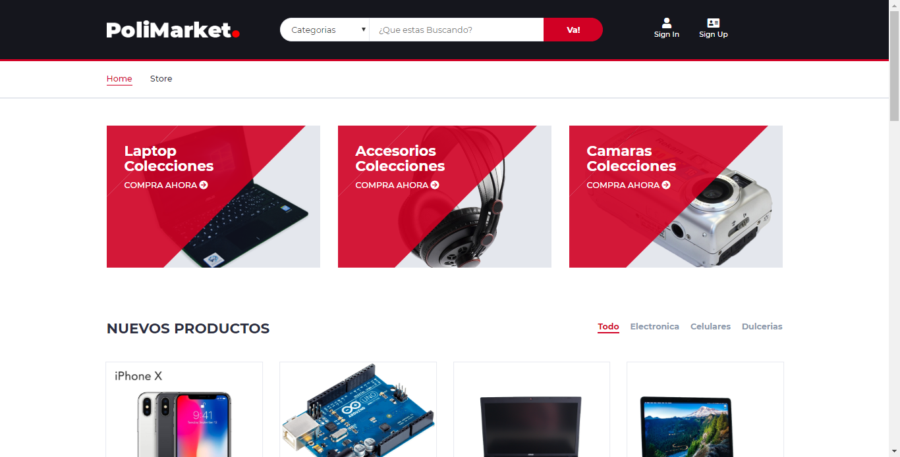

# PoliMarket :sunglasses:
---
## Descripción del sistema

Cualquier usuario previamente registrado en el sistema podrá acceder, visualizar y comprar los artículos que se encuentren disponibles en el catálogo de ventas  o simplemente navegar y ver las características de los diferentes artículos.
De igual manera podrá agregar sus propios artículos en venta.

## Fragmentación de datos

La fragmentación de los datos se distribuirá a partir del criterio de la categoria seleccionada, los datos de cada categoria estarán alojadas en un servidor distinto, las compras de los productos se alojarán en base a la ubicación del producto bajo el mismo criterio, se consideraron las siguientes escuelas:

**Escuelas :**
---------------
1. Centro Interdisciplinario de Ciencias de la Salud Unidad Milpa Alta (CICS UMA)
2. Centro Interdisciplinario de Ciencias de la Salud Unidad Santo Tomás (CICS UST)
3. Escuela Nacional de Biblioteconomía y Archivonomía (ENBA)
4. Escuela Nacional de Ciencias Biológicas (ENCB)
5. Escuela Nacional de Medicina y Homeopatía (ENMH)
6. Escuela Superior de Medicina (ESM)
7. Escuela Superior de Enfermería y Obstetricia (ESEO)
8. Escuela Superior de Comercio y Administración Unidad Tepepan (ESCA UT)
9. Escuela Superior de Comercio y Administración Unidad Santo Tomás (ESCA UST)
10. Escuela Superior de Economía (ESE)
11. Escuela Superior de Turismo (EST)
12. Escuela Superior de Ingeniería Mecánica y Eléctrica Unidad Azcapotzalco (ESIMEUA)
13. Escuela Superior de Ingeniería Mecánica y Eléctrica Unidad Culhuacán (ESIME UC)
14. Escuela Superior de Ingeniería Mecánica y Eléctrica Unidad Ticomán (ESIME UT)
15. Escuela Superior de Ingeniería Mecánica y Eléctrica Unidad Zacatenco (ESIME UZ)
16. Escuela Superior de Ingeniería y Arquitectura Unidad Tecamachalco (ESIAUTecamachalco)
17. Escuela Superior de Ingeniería y Arquitectura Unidad Ticomán (ESIA UTicomán)
18. Escuela Superior de Ingeniería y Arquitectura Unidad Zacatenco (ESIA UZ)
19. Escuela Superior de Ingeniería Química e Industrias Extractivas (ESIQIE)
20. Escuela Superior de Ingeniería Textil (ESIT)
21. Escuela Superior de Física y Matemáticas (ESFM)
22. Escuela Superior de Cómputo (ESCOM)
23. Unidad Profesional Interdisciplinaria de Ingeniería y Tecnologías Avanzadas (UPIITA)
24. Unidad Profesional Interdisciplinaria de Ingeniería, Ciencias Sociales y Administrativas (UPIICSA)
25. Unidad Profesional Interdisciplinaria de Biotecnología (UPIBI)
26. Unidad Profesional Interdisciplinaria de Ingeniería, Campus Guanajuato (UPIIG)
27. Unidad Profesional Interdisciplinaria De Ingeniería, Campus Zacatecas (UPIIZ)
28. Unidad Profesional Interdisciplinaria De Ingeniería, Campus Hidalgo (UPIIH)
---
# Análisis Top-Down:
En el sistema propuesto se utilizará un enfoque de análisis de datos Top-Down ya que partimos de un modelo relacional general para la implementación de un red de mercado de mercancías entre las 28 escuelas del Instituto Politécnico Nacional. La fragmentación se emplea dividiendo la tabla de productos por 14 categorías propuestas en éste documento, la cual nos da 14 fragmentos de la tabla mencionada que serán distribuidas en los 3 servidores de SQL Server.

---
## Funcionalidades del Sistema:

### Registro de Usuarios: 
Habrá un panel para que nuevos usuarios puedan registrarse a la plataforma.

### Perfil de Usuario:
El usuario tendrá un panel para editar su perfil, así como para subir sus productos a vender y su historial de compras.
El usuario propietario no podrá hacer compra de sus propios productos.

### Inicio de Sesión:
Para poder comprar o publicar productos será necesario que el usuario inicie  sesión con los datos siguientes: Correo Electrónico o Nombre de usuario, Contraseña.

### Publicación de Productos:
Todo usuario registrado podrá publicar sus productos acompañado de máximo 5 fotografías del producto, precio, categoría y una breve descripción.

### Catálogo de Productos:
Se tendrá una vista general de todos los productos publicados con un buscador por descripción y/o filtro de categoría y precio.
Habrá un sección donde se tendrán los productos organizados por categoría, el cliente podrá seleccionar la categoría  

### Carrito de Compras
El carrito será una venta POP UP donde se mostrara las productos seleccionados por el cliente, la cantidad y precio por unidad y el total de la compra acumulado al momento.
Tendrá la opción de concretar la compra de los producto la cual lo direccionará al apartado de simulación de compra

### Simulación de compra:
Al realizar la compra se enviará por correo electrónico al usuario comprador los datos del vendedor y viceversa; el comprador se pondrá en contacto con el vendedor o viceversa, una vez concretada la venta, el vendedor podrá poner en el sistema que la venta se ha finalizado. En caso contrario que la venta no se concrete, podrá poner de nuevo disponible el producto.

---
# Consultas Distribuidas
*Búsqueda:*
---------------
* El sistema tendrá una busqueda de productos en base a su Nombre, y hara la busqueda para cualquier categoria.
* El sistema tendrá un filtro para ubicar los productos que estén en la escuela seleccionada por el usuario.
* El sistema tendrá un filtro por categoría
---
*Compra:*
---------------
* Al realizar la compra el sistema no hará distinción de la ubicación de los datos

---
# Screenshot

Mas screenshots disponibles en: https://imgur.com/gallery/BlrksTP
